# Running Google Jobs with a custom Docker image

If you've ever found yourself repeating a task quite frequently, and (like me) you paid for a service to have a server, (or used your own machine). This repo may help you!

Alternatively, Google has a product called Google Run, where you can, in their own words `Run applications fast and securely in a fully managed environment`.

Now, a feature is the possibility of executing scheduled jobs. These are the so-called `Jobs`.

In this column we will see how to create a `Job` following one of the recommended methods, that is, packaging our code in a Docker image.

----

**First**, to work with Google Run Jobs, you need to have one of the following roles:

- Cloud Run Admin: This gives you full permissions to create, update, delete, and run jobs.
- Cloud Run Invoker: This role allows you to run jobs.
- Cloud Run Viewer: It provides the ability to view and list jobs.

Why, you ask? Well, because the necessary permissions include exciting things like:

- run.jobs.{create/update/run/delete/get/list/getIamPolicy/setIamPolicy}
- run.executions.{get/list/delete}
- run.tasks.{get/list}

(Also remember this list if you are creating a custom role)

**Next**, you'll need a container image. You can choose one of these types of container images:

- Container images that are stored in the same project as the one you're creating the job or service in.
- Container images from other Google Cloud projects (assuming you have the right IAM permissions).
- Public container images from Artifact Registry, Container Registry  (Deprecated), or the Docker Hub.

But, hold onto your hat, because Google recommends the use of Artifact Registry. So that is what are we going to do!

**And** then you will be able to select your image and run your code as a scheduled Job.

----

## Creating a container image

So, according to Google, we're going to use Artifact Registry because it's the cool kid on the block. As Google puts it, "Artifact Registry provides a single location for storing and managing your packages and Docker container images."

There are three types of repositories:

- **Standard:** These are regular repositories for your private artifacts. You upload and download artifacts directly with these repositories and use Artifact Analysis to scan for vulnerabilities and other metadata.
- **Remote:** This is like a repository that goes on vacation. It acts as a proxy for an external source, like Docker Hub, Maven Central, or the Python Package Index (PyPI). It fetches stuff from an external source and keeps a copy. Lazy but effective!
- **Virtual:** This is the master of ceremonies. It acts as a single access point to download, install, or deploy artifacts from one or more upstream repositories. Virtual repositories simplify client configuration for consumers of your artifacts.

(Want more details? [Google: Repository Overview](https://cloud.google.com/artifact-registry/docs/repositories))

Although there are different 'artifact' options we will focus on creating a Docker artifact in a Standard repository.

For this, we will do the following steps:
0.- Create a new Google Project
1.- Create a private Docker repository in Artifact Registry
2.- Set up authentication (this will allow Docker to push the image to our Artifact Registry in Google)
3.- Push an image to the repository

### 0.- Create a new Google Project

We will create a new project 'cumplo-jobs', make sure Billing is activated, and then activate the `Artifact Registry API`.
Then we will install Docker and Google Cloud CLI.

We initialize the Google Cloud CLI and when prompted, we select the project we just created.

```bash
gcloud init
```

An alternative is to simply specify the project we want to work with:

```bash
gcloud config set project cumplo-jobs
```

### 1.- Create a private Docker repository in Artifact Registry

Run the following command to create a new Docker repository named `cumplo-jobs-docker-repo` in the location `us-central1` with the description `"Docker repository for Cumplo Jobs"`.

```bash
gcloud artifacts repositories create cumplo-jobs-docker-repo \
  --repository-format=docker \
  --location=us-central1 \
  --description="Docker repository for Cumplo Jobs"
```

Which will give us an output similar to this:

```bash
Create request issued for: [cumplo-jobs-docker-repo]
Waiting for operation [projects/cumplo-jobs/locations/us-central1/operations/12abc123-f0ab-12d1-a0ff-0c75bf1ef26a] to complete...done.
Created repository [cumplo-jobs-docker-repo].
```

We can check that the repository has been created with:

```bash
gcloud artifacts repositories list
```

### 2.- Set up authentication

The first step to being able to push or pull images is to configure Docker so that you can use the Google Cloud CLI to make requests to the Artifact Library.

For that, we execute this command

```bash
gcloud auth configure-docker us-central1-docker.pkg.dev
```

Which will give us an output similar to this:

```bash
Adding credentials for: us-central1-docker.pkg.dev
After update, the following will be written to your Docker config file located at [/Users/mayo_nesso/.docker/config.json]:
 {
  "credHelpers": {
    "us-central1-docker.pkg.dev": "gcloud"
  }
}

Do you want to continue (Y/n)?  y

Docker configuration file updated.
```

This updates our Docker configuration, and we should now be able to push an image!

### 3.- Push an image to the repository

Google's tutorial, guides us to download an image from the Docker repository, but in our case, we will use a locally built image to illustrate a more practical example.

#### 3.1.- Our docker image

We have a folder called our_docker_image where we have a `Dockerfile` and an `app.py` file, this is enough to illustrate the creation of a Docker image that will be uploaded to the registry.

We go to `our_docker_image` folder (where our Dockerfile is located), then we will build an image.

In this step, we have to carefully specify the `name` of our container since it has to have some **important details**.

The **important details** are the `Repository location`, the `Project id`, and the `Artifact Repository id` that we have been using.

In our example, the name of the image will be `simple_image`, and the tag just `tag1`.

So recapitulating we have;

- Repository location: `us-central1`
- Project id: `cumplo-jobs`
- Artifact repository id: `cumplo-jobs-docker-repo`
- Image Name: `simple_image`
- tag: `tag1`

With all that in mind, the build command will be:

```bash
cd our_docker_image
docker build  -t us-central1-docker.pkg.dev/cumplo-jobs/cumplo-jobs-docker-repo/simple_image:tag1 .
```

> **_Important!_**
>
>Since Google Cloud Platform requires an AMD image to run it, if you are on Apple silicon (M1, M2,...), then the generated build will not work
> ([more info in this SO thread](https://stackoverflow.com/questions/66823012/i-am-using-pycharm-and-cloud-run-plugin-to-deploy-flask-app-to-gcp-on-a-mac-m1-a))!
>
>To fix that, you will have to follow this steps to create the image!
>First, check if you have a builder that can create a `linux/amd64` image
>
>```bash
>docker buildx ls
>```
>
>Output:
>
>```bash
>NAME/NODE       DRIVER/ENDPOINT STATUS  BUILDKIT             PLATFORMS
>default         docker
>  default       default         running v0.11.6+616c3f613b54 linux/arm64, linux/amd64, linux/amd64/v2, linux/riscv64, linux/ppc64le, linux/s390x, linux/386, linux/mips64le, linux/mips64, linux/arm/v7, linux/arm/v6
>desktop-linux * docker
>  desktop-linux desktop-linux   running v0.11.6+616c3f613b54 linux/arm64, linux/amd64, linux/amd64/v2, linux/riscv64, linux/ppc64le, linux/s390x, linux/386, linux/mips64le, linux/mips64, linux/arm/v7, linux/arm/v6
>```
>
>If so, we proceed with our _modified_ build command:
>
>```bash
>cd our_docker_image
>docker buildx build --platform linux/amd64 -t us-central1-docker.pkg.dev/cumplo-jobs/cumplo-jobs-docker-repo/simple_image:tag1 .
>```
>
> If we don't find a builder with the `linux/amd64` capability, we will have to create one ([see here that and other options](https://docs.docker.com/build/building/multi-platform/)).
>

----

#### 3.2.- Pushing our image

Finally, to push the image we use this command:

```bash
docker push us-central1-docker.pkg.dev/cumplo-jobs/cumplo-jobs-docker-repo/simple_image:tag1
```

That will give us something like:

```bash
The push refers to repository [us-central1-docker.pkg.dev/cumplo-jobs/cumplo-jobs-docker-repo/simple_image]
13317470e910: Pushed
1fd51346f743: Pushed
a130a3c46754: Pushed
762ff2f0c641: Pushed
a1bf4fc22850: Pushed
f94bda6a158c: Pushed
3ce829cc4970: Pushed
tag1: digest: sha256:c1918dc3eadf6123c338669c5a2934f607c40052a8614d3d7b26e23e4b3cf66a size: 1783
```

----

Then, we can check on the Google Cloud Console, that the repo, and image are there 😃!

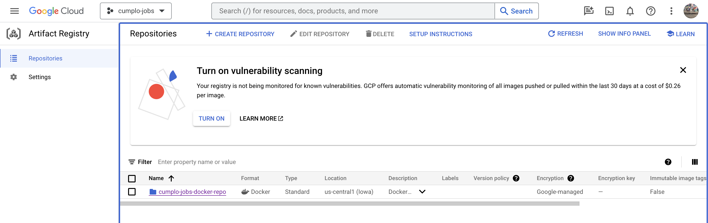

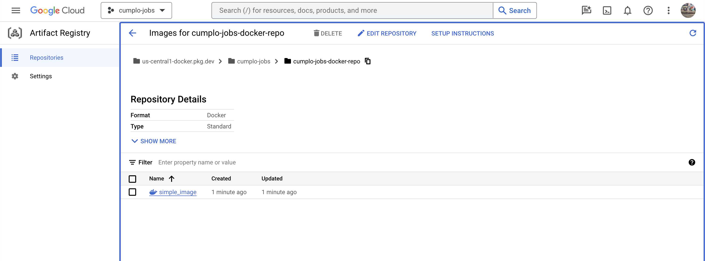

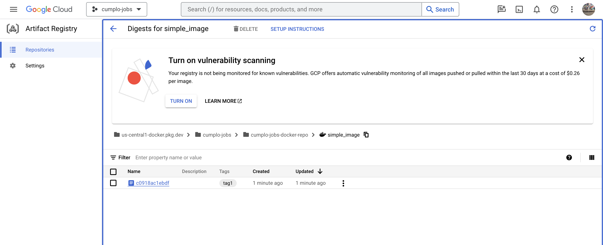

----

Great, we now have our image in the Artifact Repository!
Now, to run the Job, we go to our Google Console, select our project, and go to `Cloud Run`:

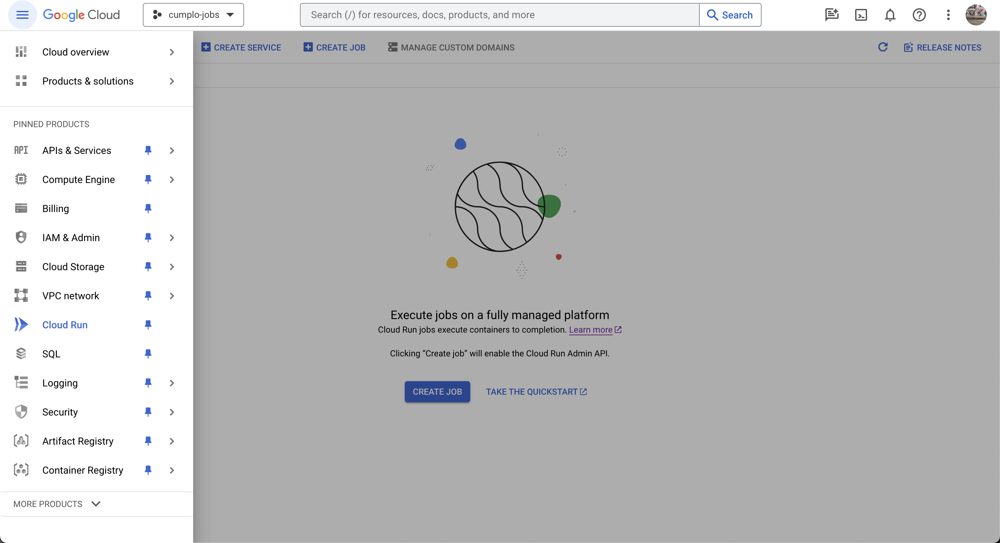

We select `Jobs`:

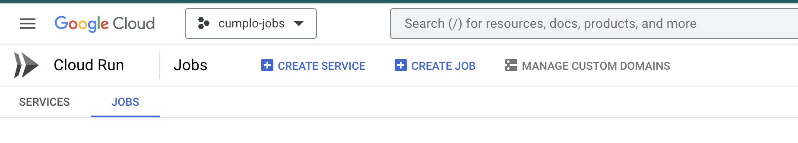

And there we will create a new Job (`Create Job`):

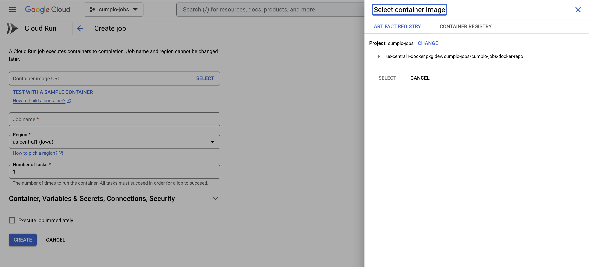

We select our image previously uploaded to the `Artifact Registry`:

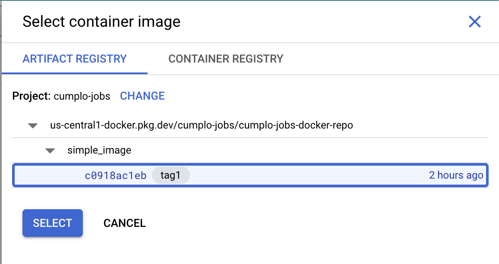

We name our job, and create it (We can select "Execute job immediately" to see what results from the execution)!

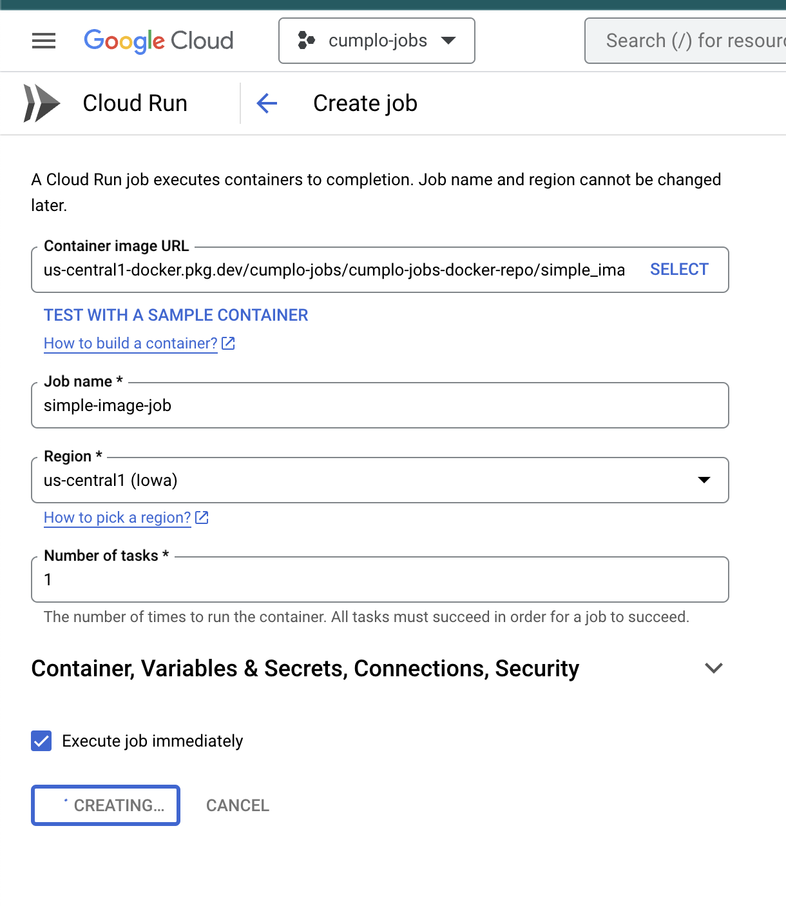

After a moment, our Job will be created!

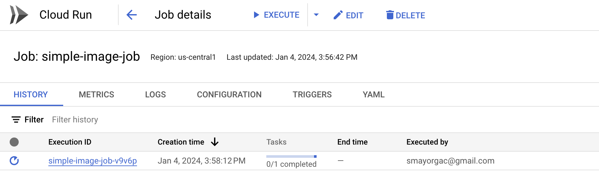

If everything goes well, we should see the green light after our test run:

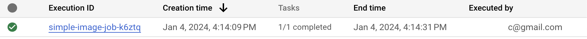

Job details:

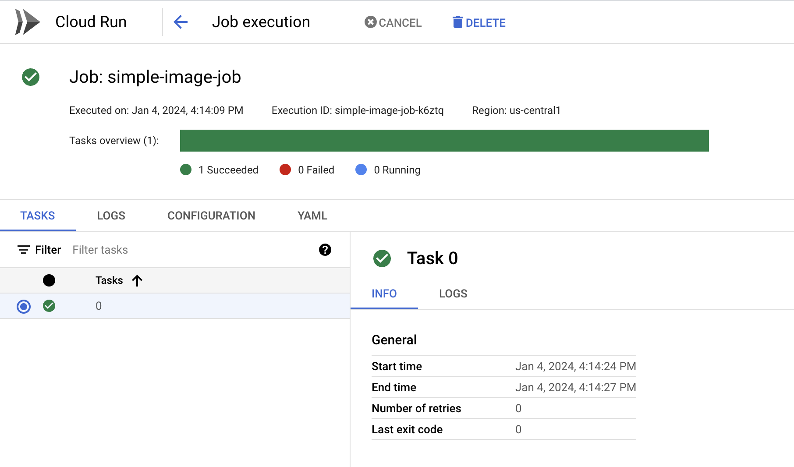

And voila!

----

Useful links:

- [Google: Repository Overview](https://cloud.google.com/artifact-registry/docs/repositories)
- [Google Doc: Store Docker container images in Artifact Registry](https://cloud.google.com/artifact-registry/docs/docker/store-docker-container-images)
- [Google Doc: Create Jobs Docs](https://cloud.google.com/run/docs/create-jobs#console)
- [Docker Doc: Multi-platform images](https://docs.docker.com/build/building/multi-platform/)
